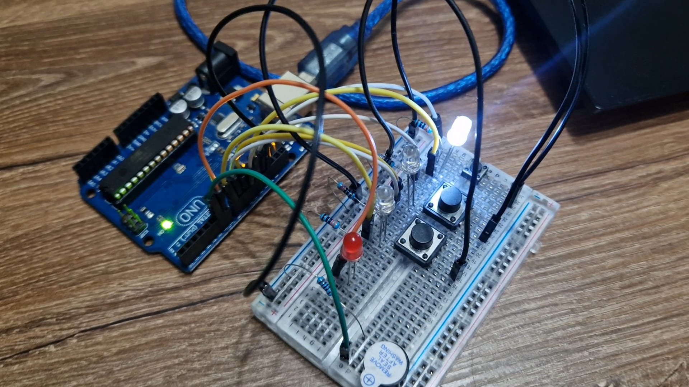

# Homework 3 - ELEVATOR WANNABE
**Task**: Design a control system that simulates a 3-floor elevator using the Arduino
platform. Here are the specific requirements:
- LED Indicators: Each of the 3 LEDs should represent one of the 3 floors.
The LED corresponding to the current floor should light up. Additionally,
another LED should represent the elevator’s operational state. It should
blink when the elevator is moving and remain static when stationary.
- Buttons: Implement 3 buttons that represent the call buttons from the
3 floors. When pressed, the elevator should simulate movement towards
the floor after a short interval (2-3 seconds).
- Buzzer:
The buzzer should sound briefly during the following scenarios:
    - Elevator arriving at the desired floor (something resembling a ”cling”).
    - Elevator doors closing and movement
- State Change & Timers: If the elevator is already at the desired floor,
pressing the button for that floor should have no effect. Otherwise, after
a button press, the elevator should ”wait for the doors to close” and then
”move” to the corresponding floor. If the elevator is in movement, it should do nothing.
- Debounce: Remember to implement debounce for the buttons to avoid
unintentional repeated button presses.\
**Components:**
- 4 LEDs
- 3 Buttons
- 4 Resistors for LEDs (330&#937;)
- 1 Buzzer
- Wires
- Arduino Uno

**Setup:**\

**Video:**\
[Youtube](https://youtu.be/cA7jcND93B4)
