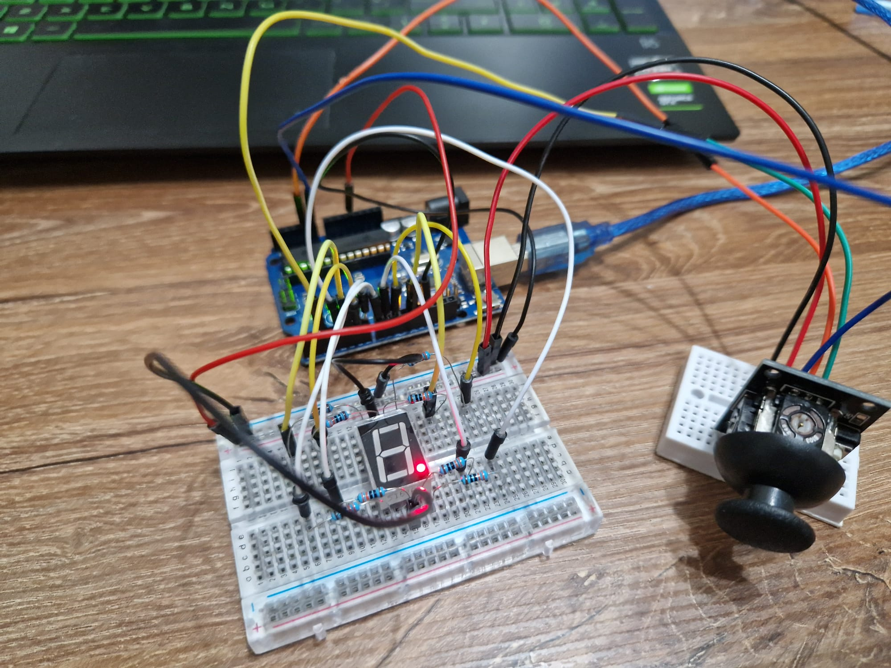

# Homework 4 - 7 segment display drawing

**Task:** You will use the joystick to control the position of the segment and ”draw” on the display. The movement between segments should be natural, meaning they should jump from the current position only to neighbors, but without passing through ”walls”. The initial position should be on the DP. The current position always blinks. Use the joystick to move from one position to neighbors. Short pressing the button toggles the segment state from ON to OFF or from OFF to ON. Long pressing the button resets the entire display by turning all the segments OFF and moving the current position to the decimal point.

**Components:**
- 7 segment display
- Joystick
- Resistors
- Wires
- Arduino Uno

**Setup:**

**Video:**
[Youtube](https://youtu.be/chUrHi8ZIb8)