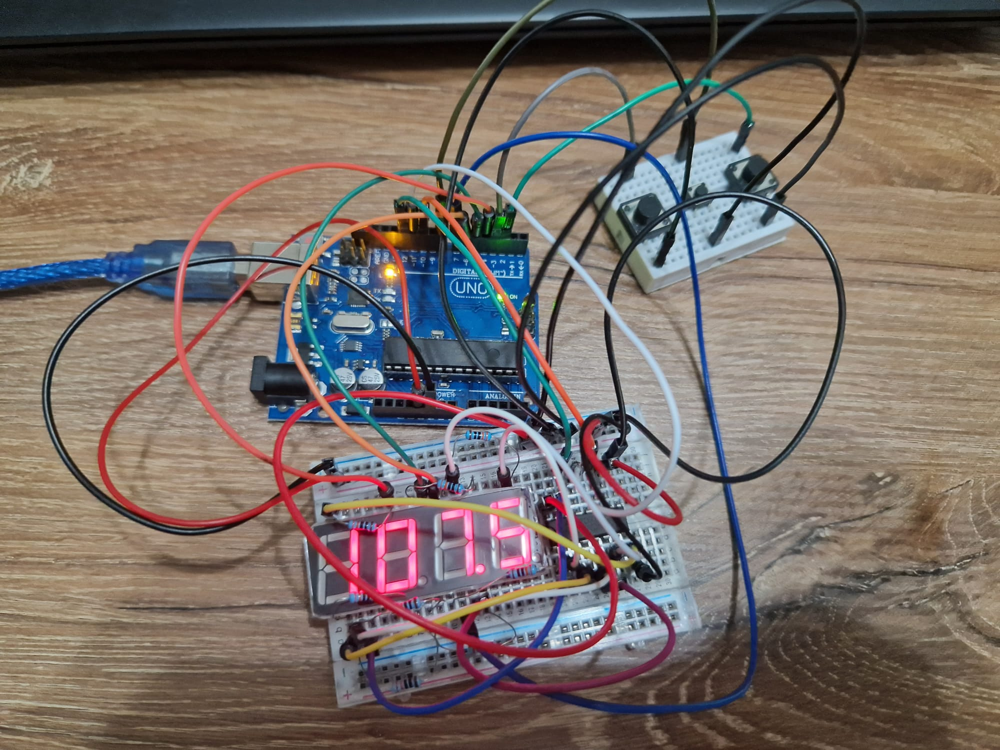

# Homework 5 - Stopwatch Timer

**Task:** Using the 4 digit 7 segment display and 3 buttons, you should implement a stopwatch timer that counts in 10ths of a second and has a save lap functionality. The format used by me is m:ss:ts. 
The starting value of the 4 digit 7 segment display should be ”0.00.0”. Buttons should have the following functionalities:
– Button 1: Start / pause.
– Button 2: Reset (if in pause mode). Reset saved laps (if in lap viewing mode).
– Button 3: Save lap (if in counting mode), cycle through last saved laps (up to 4 laps).

**Components:**
- 4 digit 7 segment display
- 3 buttons
- Resistors
- Wires
- Arduino Uno

**Setup:**

**Video:**
[Youtube](https://youtu.be/zae-edc3oFg)