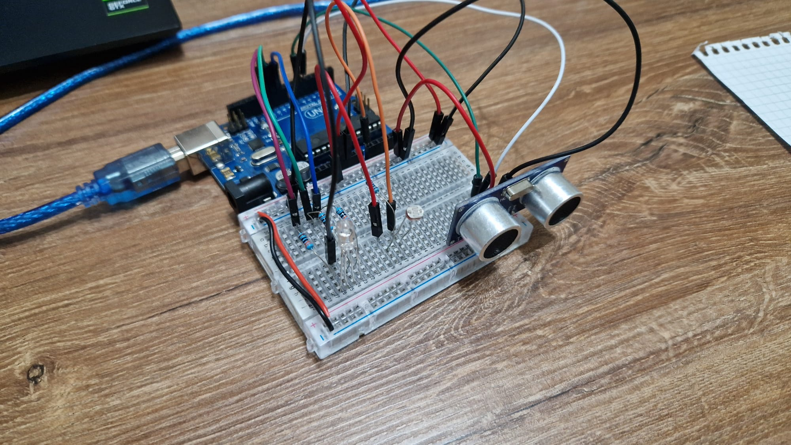

# Smart Environment Monitor and Logger

## Overview

The Smart Environment Monitor and Logger is an Arduino-based project designed for efficient environmental monitoring and data logging. This system utilizes EEPROM-stored values, including thresholds for ultrasonic and LDR sensors, along with a customizable sensor sampling interval. The project seamlessly integrates RGB LED control, providing both automatic color adjustments based on sensor readings and manual color settings.

## Features

### EEPROM-Stored Values

- **Ultrasonic Alert Threshold:** Adjustable threshold for the ultrasonic sensor.
- **LDR Alert Threshold:** Customizable threshold for the Light-Dependent Resistor (LDR) sensor.
- **Sensor Sampling Interval:** User-defined interval for data sampling.

### RGB LED Control

- **Automatic Mode:** Adaptive color changes based on real-time sensor readings.
- **Manual Mode:** User-defined RGB values for custom visual feedback.

### Sensor Integration

- **Photocell Sensor:** Captures ambient light conditions.
- **Ultrasonic Sensor:** Measures distance from obstacles.

### Data Logging and Reset

- **Efficient Storage:** Sensor data is stored efficiently in EEPROM.
- **Data Reset Functionality:** Users can initiate a reset of the stored data.

### User Interface

- **Structured Menu System:** Intuitive user interaction through a Serial Menu.
- **Current Sensor Readings:** Display of real-time sensor readings.
- **System Status:** Overview of current settings and thresholds.

## Usage

1. **Setting Configuration:**
   - Access sensor settings such as sampling interval, ultrasonic alert threshold, and LDR alert threshold.

2. **RGB LED Control:**
   - Choose between automatic mode with adaptive color changes or manual mode for custom RGB values.

3. **Sensor Integration:**
   - Utilize the photocell and ultrasonic sensors for ambient light and distance measurements.

4. **Data Logging and Reset:**
   - Efficient storage and user-initiated reset of sensor data.

5. **User Interface:**
   - Navigate through the structured menu system for an intuitive user experience.

## Setup

## Video
[Youtube](https://youtu.be/M8jUNU4ppHE)

