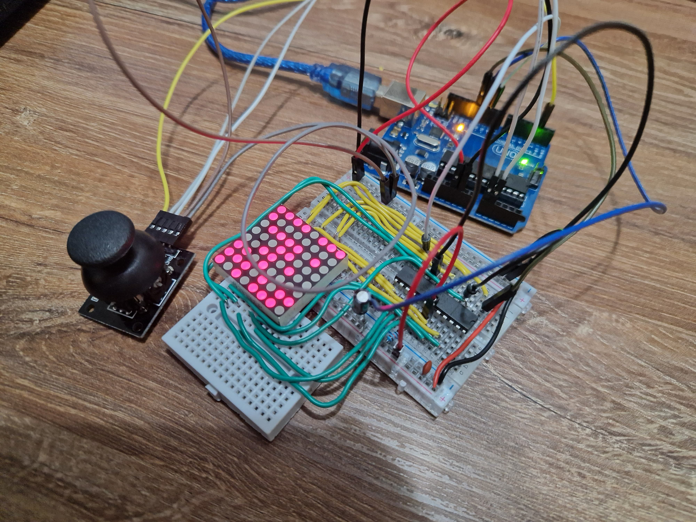

# 8x8 Matrix Game: Bomber Challenge

## Project Overview
Developed as an engaging introduction to matrix projects, the Bomber Challenge is a small-scale game tailored for an 8x8 matrix display. The game incorporates three distinct elements: a controlled player character with a slow blinking pattern, dynamic bombs/bullets displaying rapid blinks, and stationary walls strategically placed on the map. This project serves as a foundational exploration of matrix-based gaming concepts.

## Key Game Elements
- **Player Character:**
  - Controlled by user input
  - Movement within the matrix
  - Slow blinking pattern for enhanced visibility

- **Bombs/Bullets:**
  - Rapid blinking pattern for visibility
  - Deployed strategically by the player
  - Detonation mechanism to clear walls

- **Walls:**
  - Stationary map elements
  - Randomly generated on the map (50% - 75% coverage)
  - Game objective: Strategic destruction of walls using bombs

## Gameplay Dynamics
1. **Player Control:**
   - User input governs the movement of the player character through the matrix.

2. **Bomb Deployment:**
   - Strategic placement of bombs to strategically clear walls.
   - Bombs automatically detonate after a predefined duration.

3. **Game Objective:**
   - The primary goal is to systematically destroy as many walls as possible within the game's constraints.

## Technical Implementation

## Video
[Youtube](https://youtu.be/tfFzZLYNBlY)

