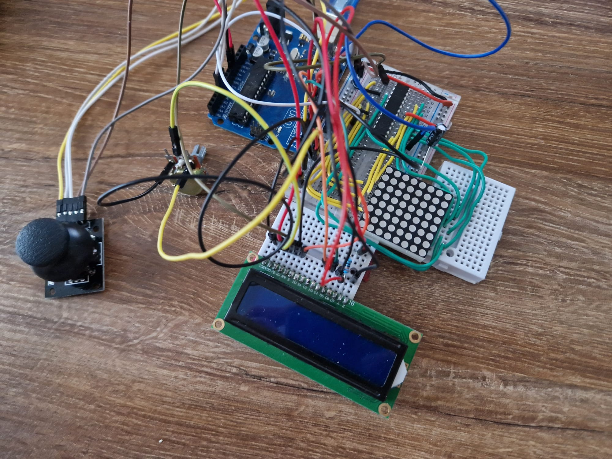

# Matrix Project Enhancement: Basic Functionality

## Objective
The primary goal for this checkpoint is to enhance the basic functionality of the matrix project. The following features have been incorporated to elevate the user experience:

### 1. Intro Message
- Upon powering up the project, a welcoming message is displayed for a brief period, creating an engaging start to the user's interaction with the system.

### 2. Menu
- **Start Game:**
  - Initiates the initial level of the Super Mario Bros-inspired game, providing users with an immersive gaming experience.

- **Settings:**
  - (a) **LCD Brightness Control:**
    - Allows users to control the brightness of the LCD display.
    - The value is stored in EEPROM and retrieved upon system start.
    
  - (b) **Matrix Brightness Control:**
    - Utilizes the `setIntensity` function from the led-Control library for controlling matrix brightness.
    - Displays relevant information on the matrix when selecting brightness control.
    - The brightness value is saved to EEPROM and loaded during system startup.

- **About:**
  - Displays details about the creators of the game, including the game name, author, and a link to the GitHub repository.
  - Utilizes scrolling text for a visually appealing presentation.

### 3. End Message
- Upon completion of the game (character death or reaching the end of the map), a concluding message is presented.
- Awaiting user prompt, such as a button push, before returning to the main menu.

### 4. During Gameplay
- (a) **Show Relevant Details:**
  - Displays dynamic details during gameplay, such as time, level, lives, or other relevant information.
  - Incorporates LED indicators to represent the number of active elements in the game.

- (b) **End Game / Level Functionality:**
  - Implements an end-game/level functionality triggered by conditions like character death or reaching the end of the map.
  - Displays the designated message, awaits user input, and returns to the main menu.

## Technical Implementation

## Video
[Youtube](https://youtu.be/MCacTHsDuo4)